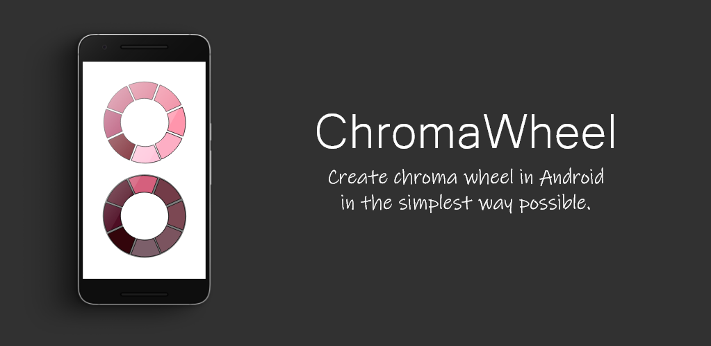

# ChromaWheelKotlin 
Library for creating chroma wheel written in Kotlin

<p align="center">
    
</p>
 
## About
Library for creating chroma wheel as View, where you set selected color and number of chroma color that will be generated from the selected color. Chroma colors are generated by changing the L-lightness property using the HSL(Hue,Saturation,Lightness) model. Half of the generated colors are darker and the other half are lighter then the selected color as the user can choose his preferred color. To learn more about the library and how it works in general you can check the **[wiki](https://github.com/slaviboy/ChromaWheelKotlin/wiki)** page.
 
[](http://developer.android.com/index.html)
[](https://android-arsenal.com/api?level=21)
[](https://github.com/slaviboy/ChromaWheelKotlin/releases/tag/v0.0.1)

Supported properties are:
* **numberOfChromaColors** 
* **spaceBetweenColorBlocks**  
* **bigCircleRadius**  
* **smallCircleRadius**  
* **colorBlockStrokeColor** 
* **strokeColorDifference** 
* **selectedColor**  
* **overlayShadowColor** 
* **animationDuration** 
* **useStrokeForFirstBlockOnly** 

## Add to your project
Add the jitpack maven repository
```
allprojects {
  repositories {
    ...
    maven { url 'https://jitpack.io' }
  }
}
``` 
Add the dependency
```
dependencies {
   implementation 'com.github.slaviboy:ChromaWheelKotlin:v0.0.1'
}
```
 
### How to use

First add ChromaWheelView to your xml file  

```xml
<com.slaviboy.chromawheel.ChromaWheelView
    android:id="@+id/chroma_wheel_view"
    android:layout_width="match_parent"
    android:layout_height="match_parent"
    app:animationDuration="1000"
    app:bigCircleRadius="0.6"
    app:numberOfChromaColors="5"
    app:overlayShadowColor="#83040404"
    app:selectedColor="#2578C1"
    app:smallCircleRadius="0.4" />
```

To detect when the user selects different chroma color from the color wheel you can attach listener using the method **setOnColorSelectedListener()**. You can change the properties of the color wheel in real time using Kotlin/Java.

```kotlin

// get the view by id
val chromaWheelView = findViewById(R.id.chroma_wheel_view)

// attach listener to detect when the user selects new color block
chromaWheelView.setOnColorSelectedListener { view, clickedBlockIndex ->
    // here you can
}

// change properties
chromaWheelView.selectedColor = Color.rgb(25, 122, 51)

```

_**Important!**_  
_**Since the library uses [ValueAnimator](https://developer.android.com/reference/android/animation/ValueAnimator), that use a looper with handler thread you must stop the animation usually at onPause() method in case the activity or fragment gets destroyed accidentally before the animation has finished to prevent memory leaks.**_ 
```kotlin
override fun onPause() {
    super.onPause()

    // destroy the animation to prevent memory leaks
    chromaWheelView.destroyAnimation()
}
```
